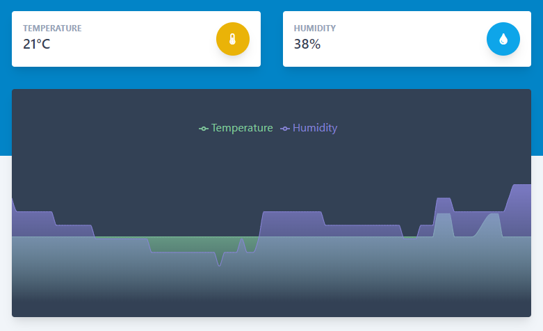
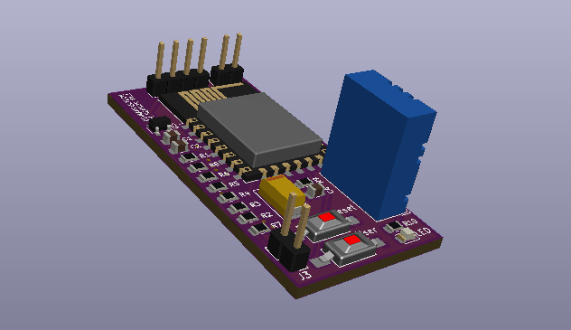
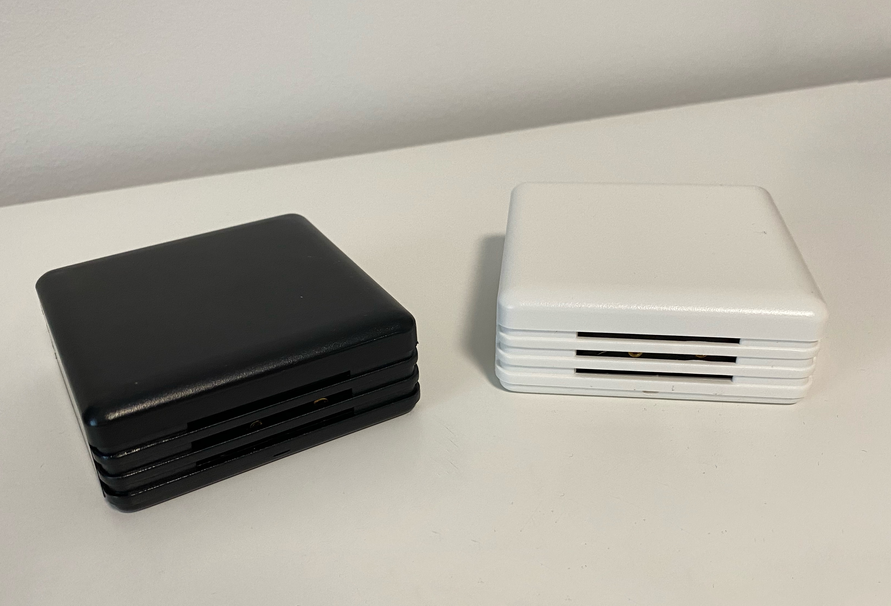

# Home app project
Full solution for temperature &amp; humidity indoor monitoring. 
But main goal of the project is to add more and more home monitoring and automation functionality.

## Project structure and stack
- `th-api` - server written in *Java/SpringBoot* and *PostreSQL, Docker*.
- `th-web` - client written in *JavaScript* with *React*.
- `th-board` - PCB schematics and board, *KiCad* project.
- `th-esp` - sensor sources written with *Arduino* libraries.
- `docs` - other files

## Client preview

~~Project is published, you can check it here:
https://deimantas.tech/th/~~

Screenshot/preview of one sensor measurements:

## Sensor

Temperature and humidity sensor board is based on `ESP8266` microcontroller in the `ESP-12F` (or `ESP-12E`) module.
For measurements `DHT11` sensor is used

PCB Render and assembled vew:

 

## Workflow

After sensor has been turned on for the first time, it will create WiFi AP. Connect to it using your phone to configure it. You will need to enter your home WiFi info and an email of your `deimantas.tech/th` account, so sensor will register itself to your account. If something goes wrong you can always reset your sensor by pressing `reset button` while holding `user button`. After successfull configuration sensor should appear in Settings tab of the client app.

## Running locally

### Server side

To start API and database the simplest way would be to run it in docker container. Run this command in *th-app-project/th-api* folder:

`docker-compose up`

### Client

To start client application run these regular React commands in *th-app-project/th-web* folder:

`npm install`

`npm start`

> Don't forget to change API url to your own server address :)

